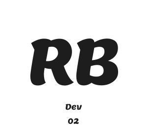

<div align="center" style="margin-bottom: 10px;">



</div>
<div align="center" style="display: flex; gap: 10px; align-items:center; justify-content: center; margin-top:50px;">

[](https://astro.build)


</div>

Olá, seja bem vindo esse é o repositório do meu portfólio que contém alguns dos meus projeto, criado utilizando Astro, React e Tailwind CSS. Este projeto tem como objetivo demonstrar como funciona o passo a passo do desenvolvimento dos projetos, qual a ideia por tras de alguns deles, e também ele contém um blog em que eu escrevo sobre alguns assuntos relacionados a tecnologia.

## Instalação

1. **Clone o repositório:**

   ```bash
   git clone https://github.com/RelancioBorgesDev/Meu-Portfolio
   ```

2. **Navegue até o diretório do projeto:**

   ```bash
   cd portfolio-frontend
   ```

3. **Instale as dependências:**

   ```bash
   npm install
   ```

## Uso

Para iniciar o servidor de desenvolvimento, execute:

```bash
npm run dev
```

Abra [http://localhost:4321](http://localhost:4321) no seu navegador para ver o projeto.

## Estrutura do Projeto

A estrutura básica do projeto é a seguinte:

```
portfolio-final/
├── public/
├── src/
│   ├── components/         # Componentes React e Astro
│   ├── content/            # Conteudos md
│   ├── layouts/            # Layouts das páginas
│   ├── lib/                # Utils do shadcn
│   ├── pages/              # Páginas do site
│   └── utils/              # Funçoes utilitarias
├── astro.config.mjs        # Configuração do Astro
├── tailwind.config.mjs      # Configuração do Tailwind CSS
├── package.json            # Dependências e scripts
└── README.md               # Documentação do projeto
```

## Contato

Para qualquer dúvida ou sugestão, entre em contato através de:

- **Email:** relancio.dev@gmail.com
- **LinkedIn:** [Meu Linkedin](https://www.linkedin.com/in/relancio-borges-4716a620b/)
- **Site:** [Meu Portfólio](https://relancioborgesdev.github.io/)

---

Obrigado por visitar meu portfólio!
